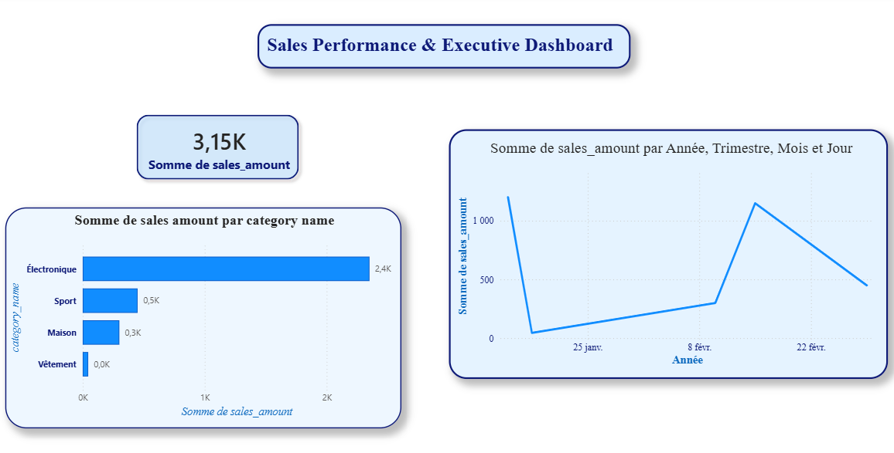

# 📊 Sales Performance Dashboard

## Description du Projet
Ce projet consiste en une analyse complète de la performance commerciale d'une entreprise e-commerce. L'objectif est de transformer des données brutes en indicateurs clés de performance (KPI) pour faciliter la prise de décision stratégique. 

Ce projet démontre un processus "end-to-end" : de l'extraction et du nettoyage des données jusqu'à la modélisation et la visualisation interactive.

## 🛠️ Technologies Utilisées
- **SQL** : Extraction, nettoyage et agrégation des données (`JOIN`, `GROUP BY`, `Window Functions`).
- **Python (Pandas)** : Prétraitement, gestion des valeurs manquantes et ingénierie de variables.
- **Power BI** : Modélisation en étoile (*Star Schema*), calculs DAX et création de rapports interactifs.

## 📂 Structure du Dépôt
- `/sql` : Scripts SQL utilisés pour l'extraction et l'analyse.
- `/python` : Script Python pour le nettoyage et la préparation des données.
- `/dashboard` : Aperçu visuel du rapport Power BI.

## 🚀 Méthodologie
1. **Extraction** : Requêtes SQL pour isoler les ventes par produit, région et période.
2. **Nettoyage** : Utilisation de Python pour supprimer les doublons, traiter les valeurs manquantes et formater les dates.
3. **Modélisation** : Création d'un modèle de données cohérent dans Power BI.
4. **Visualisation** : Développement d'un dashboard interactif incluant :
   - Évolution du chiffre d'affaires mensuel.
   - Analyse de la croissance (MoM - *Month-over-Month*).
   - Top 10 des produits les plus vendus.

## 📈 Aperçu du Dashboard

## 💡 Principaux Insights

---
**Amani Tlili**  
*Junior Data Analyst | Power BI • SQL • Python*  
